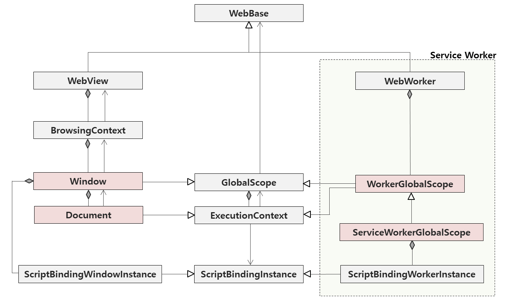

Progressive Web App Design
=============

# Service Worker


## Class diagram related to global scope



A `ServiceWorkerGlobalScope` represents the global execution context of a Service Worker.
And Service Worker has no browsing context.
The binding between JavaScript and the Native is accomplished with `ExecutionContext`.


## How to bind with JavaScript layer

If the class is exposed to the `Worker`, `ConstructorCallWith` must be `ExecutionContext`.

### idl
```
[
 Constructor,
 ConstructorCallWith=ExecutionContext,
 Exposed=(Window,Worker)
] interface AAA {
    ...
}
```
### C++

#### Declaration

The class must inherit `ScriptWrappable` in order to bind with JavaScript.
And you must use `DECLARE_SCRIPT_BINDING_REQUIRED_FUNCTIONS` macro to declare the function required for the binding.

`ConstructorCallWith=ExecutionContext` requires you to declare a constructor that is the first argument is `ExecutionContext`.

``` c++
class AAA : public ScriptWrappable {
public:
    DECLARE_SCRIPT_BINDING_REQUIRED_FUNCTIONS(AAA)
    AAA(ExecutionContext* executionContext);
};
```

#### Definition

`ScriptWrappable` requires `this` and `ExecutionContext` as arguments.

``` c++
AAA:AAA(ExecutionContext* executionContext)
    : ScriptWrappable(this, executionContext)
{
}
```