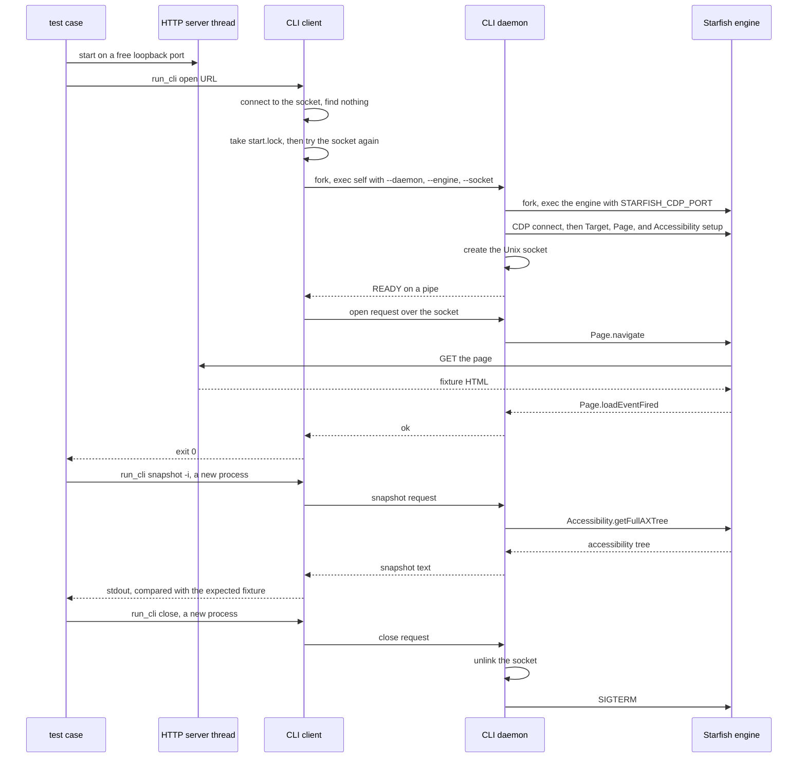

# CLI integration test harness structure

This document describes each part of `tool/cli_test` and how the parts
communicate.

## One run

`run_cli_test.py` is one Python process. It finds every `test_*.py` file under
`test/cli/` and runs the resulting `unittest` suite. Tests run sequentially.

Each test gets its own temporary `HOME` and local HTTP server. CLI commands in
the same test share one session through a Unix socket under that `HOME`.

## Processes

A live session is three separate processes.

```text
run_cli_test.py     One Python process. Runs the test cases one at a time.
      |
      |  run_cli() starts one process per command
      v
CLI client          lightweight-web-engine-cli
      |             Short lived. Exits when its command ends.
      |
      |  Unix socket under the test's temporary HOME
      v
CLI daemon          The same binary, re-executed with --daemon.
      |             Owns the socket and the session. Stays alive.
      |
      |  CDP over loopback
      v
Starfish engine     lightweight-web-engine, the binary next to the CLI.
                    A child process of the daemon.
```

The client and the daemon are the same executable. `CLI.cpp` calls
`daemonMain` when `argv[1]` is `--daemon`, and `clientMain` otherwise. A
client that reaches no session re-executes itself through `/proc/self/exe`
with `--daemon`, so the daemon is a second instance of the CLI binary.

The engine is a different binary. The client resolves its path: it reads
`/proc/self/exe`, keeps the directory, and appends the engine name. It passes
the result to the daemon as `--engine`, and the daemon runs exactly that
path. This is why `install_stalled_engine` copies the CLI and the fake engine
into one directory.

## How a test uses the fixtures

The two kinds of fixture are used in different ways.

```text
test case
    |
    +-- starts an HTTP server thread on a free loopback port
    |         serves the directory test/cli/fixtures/
    |             ^
    |             |  GET from the Starfish engine, for the page the test
    |             |  passed to `open`
    |
    +-- reads test/cli/fixtures/snapshot-interactive-expected.txt
              and compares it with what `snapshot` printed
```

A page is served over HTTP and loaded by the engine. An expected output file
is read by the test itself and never leaves the Python process.

## One open, snapshot, and close

```text
 test case      CLI client      CLI daemon     Starfish engine
     |               |               |                |
     | open URL      |               |                |
     |-------------->|               |                |
     |               | connect: no socket yet         |
     |               |               |                |
     |               | flock start.lock               |
     |               | connect again: still nothing   |
     |               |               |                |
     |               | fork, exec self with --daemon, |
     |               | --engine, and --socket         |
     |               |-------------->|                |
     |               |               | fork, exec the engine
     |               |               |--------------->|
     |               |               | CDP connect, then Target,
     |               |               | Page, and Accessibility setup
     |               |               |--------------->|
     |               |               | create the Unix socket
     |               | READY on a pipe                |
     |               |<--------------|                |
     |               | open request  |                |
     |               |-------------->| Page.navigate  |
     |               |               |--------------->|
     |               |               |                | GET the page from
     |               |               |                | the HTTP server
     |               |               | Page.loadEventFired
     |               |               |<---------------|
     |  exit 0       |               |                |
     |<--------------|               |                |
     |               |               |                |
     | snapshot      | new process   |                |
     |-------------->|-------------->| Accessibility. |
     |               |               | getFullAXTree  |
     |               |               |--------------->|
     |  tree output  |               |                |
     |<--------------|               |                |
     |               |               |                |
     | close         | new process   |                |
     |-------------->|-------------->| unlink socket, |
     |               |               | stop engine    |
     |               |               |--------------->| SIGTERM
```

### The same sequence in Mermaid

The same flow, in a form GitHub renders. This one reads better in a browser and
has room for the HTTP server thread as its own lifeline.



The daemon creates the socket only after the engine answers CDP. A startup
that fails therefore leaves no socket and no session.

The client tries the socket, takes `start.lock`, then tries the socket again
before it starts a daemon. That second try is what makes two concurrent
`open` commands share one session.

## Files

| File | What it does |
| --- | --- |
| `run_cli_test.py` | Selects the binary, discovers cases, and reports results |
| `driver/support.py` | Provides the isolated test fixture and CLI helpers |
| `driver/__init__.py` | Documents the boundary between the driver and cases |
| `driver/fixtures/stalled-engine.py` | Simulates a stalled CDP handshake |

Private test homes and the cleanup of leftovers come from
[`tool/common/storage.py`](../common/storage.py), which the CDP suite uses
too.

The behavior cases and their data live in the `test` submodule.

| Path | What it contains |
| --- | --- |
| `test/cli/test_*.py` | Command and session lifecycle cases |
| `test/cli/fixtures/` | Pages and expected command output |

## What one test does

`CLITestCase.setUp` creates all per-test state.

1. It takes a private root under `.tmp/test-cli/<pid>/` and an empty `HOME`
   inside it.
2. It starts an HTTP server on a free loopback port.
3. It copies the current environment, stamps this run as the owner, and
   removes `DISPLAY`.

The owner stamp is what makes cleanup possible later. It reaches the daemon
and the engine because each inherits the environment, so a sweep can tell a
process this run abandoned from one a running suite still owns.

The test calls `run_cli` one or more times. Each call starts a fresh CLI client
process, captures its output, and applies a 45-second timeout. The persistent
daemon and engine belong to the session, not to one CLI invocation.

`CLITestCase.tearDown` then closes the session, terminates any process that
still has the per-test `HOME`, stops the HTTP server, and removes the temporary
directory. Cleanup also runs after a test failure.

## Failed startup fixture

The session startup test must reproduce an engine that opens its CDP port but
never completes the handshake. `install_stalled_engine` copies the CLI into a
temporary `bin` directory and installs `stalled-engine.py` beside it under the
expected engine name.

This preserves the real sibling-binary lookup. It changes only the engine
implementation. The test can then check that a failed startup leaves no daemon
or engine process behind.

## State a test keeps

| Where | What | Removed |
| --- | --- | --- |
| Private `HOME` | Session socket and start lock | During teardown |
| Private `bin` | CLI copy and stalled engine, when needed | During teardown |
| HTTP server thread | Serves `test/cli/fixtures/` | During teardown |
| CLI client process | Runs one public command | When the command ends |
| CLI daemon and engine | Keep one session alive | By `close` or teardown |

The fixed session socket suffix is
`lightweight-web-engine/cli/default.sock`. Its full path remains isolated
because every test uses a different `HOME`.

Ctrl-C skips teardown, and the daemon has no idle timeout, so an interrupted
run would otherwise leave a daemon and an engine running for good. The next
run sweeps them: it kills any owned process whose owner is gone, and removes
the storage of dead runs. Both sweeps report what they cleaned.
